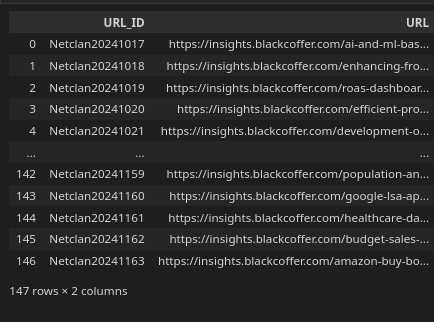

```
# NLP Assignments - Complete End-to-End

This repository provides a comprehensive solution to NLP assignments focusing on extracting article titles and main content from URLs, performing analysis, and calculating various metrics. Follow the instructions below to run the project and understand its functionalities.

---

More info about this assignment checkout "./Objective.docx"

## How to Run the Assignment

1. Ensure you have Python 3 installed on your system.
2. Place your input data in the `Input.xlsx` file in the root directory.
3. Run the following command:

```bash
python3 run.py ./Input.xlsx
```

---

## Input Data

The input file `Input.xlsx` should contain the following columns:

| Column Name           | Description                               |
|-----------------------|-------------------------------------------|
| URL_ID                | Unique ID for each URL                   |
| URL                   | The URL to extract data from             |

### Sample Input Screenshot


---

## Output Data

The output will include the processed results saved in an Excel file. Metrics calculated include:

1. Sentiment Analysis: Positive, Negative, Polarity, and Subjectivity scores.
2. Readability Metrics: Average Sentence Length, Percentage of Complex Words, FOG Index, and others.
3. Word Statistics: Word Count, Syllables per Word, and Average Word Length.
4. Basically perform feature engineering from data which can be extracted from given URL

### Expected Output
| Column Name           | Description                               |
|-----------------------|-------------------------------------------|
| URL_ID                | Unique ID for each URL                   |
| URL                   | The URL to extract data from             |
| POSITIVE SCORE        | Score for positive sentiment             |
| NEGATIVE SCORE        | Score for negative sentiment             |
| POLARITY SCORE        | Overall polarity score                   |
| SUBJECTIVITY SCORE    | Subjectivity of the content               |
| AVG SENTENCE LENGTH   | Average length of sentences               |
| PERCENTAGE OF COMPLEX WORDS | Percentage of complex words       |
| FOG INDEX             | Readability index                        |
| AVG NUMBER OF WORDS PER SENTENCE | Average word count per sentence |
| COMPLEX WORD COUNT    | Number of complex words                  |
| WORD COUNT            | Total number of words                    |
| SYLLABLE PER WORD     | Syllable count per word                  |
| PERSONAL PRONOUNS     | Count of personal pronouns               |
| AVG WORD LENGTH       | Average length of words                  |


---

Data Crawling Implementation

```python

from bs4 import BeautifulSoup
import httpx

def data_crawling_fn(url: str) -> str:
    """
        Following function send request to given url and extract 2 useful info
        Article title and Article text

        str, eg. title$text

        resultant string will be seperated by delimeter '$'
    """

    print("=======" * 12)
    print("Data Crawling Started...")
    print("=======" * 12)

    html = httpx.get(url)
    soup = BeautifulSoup(html, "html.parser")

    # Article title
    title = soup.find('h1', class_="entry-title").text

    # Article text
    article_text = soup.find('div', class_="td-post-content").text

    article_data = title.strip() + "$" + article_text.strip()

    # print(article_data)

    return article_data
```

Data Formating and Logic for Each Features

```python
def data_formatting_fn(df: pd.DataFrame):

    print("=======" * 12)
    print("Generating Results from given data...")
    print("=======" * 12)


    if "crawled_data" not in df.columns:
        raise ValueError("Column name 'crawled_data' is not available, you need to crawl data using src/data_crawler")
    
    return (
        df
        .assign(
            ARTICLE_DATA_CASE=lambda df_: df_.crawled_data.replace("$", " ").apply(removing_stopwords_fn),
            ARTICLE_DATA=lambda df_: df_.ARTICLE_DATA_CASE.str.lower(),

            # Creating a dictionary of Positive and Negative words
            SCORES=lambda df_: df_.ARTICLE_DATA.apply(get_score_fn),

            # Extracting Derived variables
            POSITIVE_SCORE=lambda df_: df_.SCORES.str.split("|").str[0].astype("int"),
            NEGATIVE_SCORE=lambda df_: df_.SCORES.str.split("|").str[1].astype("int"),
            NEUTRAL_SCORE = lambda df_: df_.SCORES.str.split("|").str[2].astype("int"),
            POLARITY_SCORE=lambda df_: (
                # formula : (pos_score - neg_score) / ((pos_score + neg_score) + 0.000001)
                (df_.POSITIVE_SCORE - df_.NEGATIVE_SCORE) / ((df_.POSITIVE_SCORE + df_.NEGATIVE_SCORE) + 0.000001)
            ),
            SUBJECTIVITY_SCORE=lambda df_: (
                # formula : (pos_score + neg_score) / (total_words + 0.000001)
                (df_.POSITIVE_SCORE + df_.NEGATIVE_SCORE) / ((df_.POSITIVE_SCORE + df_.NEGATIVE_SCORE + df_.NEUTRAL_SCORE) + 0.000001)
            ),

            # Analysis of Readability
            # Word Count
            WORD_COUNT=lambda df_: df_.ARTICLE_DATA.str.split(" ").str.len(),
            SENTENCE_COUNT=lambda df_: df_.ARTICLE_DATA.apply(get_num_of_sentences_fn),

            # Syllable Count Per Word
            SYLLABLE_PER_WORD=lambda df_: df_.ARTICLE_DATA.apply(count_syllables_per_word_fn),
            AVG_SENTENCE_LENGTH=lambda df_: df_.WORD_COUNT / df_.SENTENCE_COUNT,

            # Complex Word Count
            COMPLEX_WORD_COUNT=lambda df_: df_.ARTICLE_DATA.apply(get_num_of_complex_words_fn),
            PERCENTAGE_OF_COMPLEX_WORDS=lambda df_: df_.COMPLEX_WORD_COUNT / df_.WORD_COUNT,
            FOG_INDEX=lambda df_: 0.4 * (df_.AVG_SENTENCE_LENGTH + df_.PERCENTAGE_OF_COMPLEX_WORDS),

            # Average Number of Words Per Sentence
            AVG_NUMBER_OF_WORDS_PER_SENTENCE=lambda df_: df_.SYLLABLE_PER_WORD.apply(sum) / df_.WORD_COUNT,

            # Personal Pronouns
            PERSONAL_PRONOUNS=lambda df_: df_.ARTICLE_DATA_CASE.apply(count_personal_pronouns_fn),

            # Average Word Length
            AVG_WORD_LENGTH=lambda df_: df_.ARTICLE_DATA.str.replace(" ", "").str.split("").apply(len) / df_.WORD_COUNT
        )
        .drop(columns=['crawled_data'])

        [['URL_ID', 'URL', 'POSITIVE_SCORE',
        'NEGATIVE_SCORE', 'POLARITY_SCORE',
        'SUBJECTIVITY_SCORE',
        'AVG_SENTENCE_LENGTH', 'PERCENTAGE_OF_COMPLEX_WORDS',
        'FOG_INDEX', 'AVG_NUMBER_OF_WORDS_PER_SENTENCE',
        'COMPLEX_WORD_COUNT', 'WORD_COUNT', 'SYLLABLE_PER_WORD',
        'PERSONAL_PRONOUNS', 'AVG_WORD_LENGTH']]

        .rename(columns=lambda df_: df_.replace("_", " "))
        .rename(columns={"URL ID" : "URL_ID"})
    )
```
---
