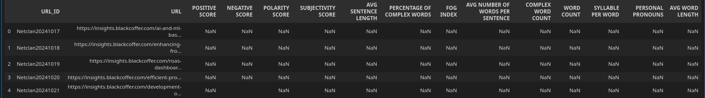
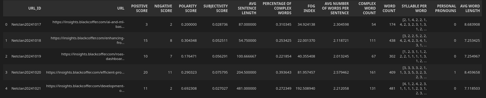

```
# NLP Assignments - Complete End-to-End

This repository provides a comprehensive solution to NLP assignments focusing on extracting article titles and main content from URLs, performing analysis, and calculating various metrics. Follow the instructions below to run the project and understand its functionalities.

---

## How to Run the Assignment

1. Ensure you have Python 3 installed on your system.
2. Place your input data in the `Input.xlsx` file in the root directory.
3. Run the following command:

```bash
python3 run.py ./Input.xlsx
```

---

## Input Data

The input file `Input.xlsx` should contain the following columns:

| Column Name           | Description                               |
|-----------------------|-------------------------------------------|
| URL_ID                | Unique ID for each URL                   |
| URL                   | The URL to extract data from             |
| POSITIVE SCORE        | Score for positive sentiment             |
| NEGATIVE SCORE        | Score for negative sentiment             |
| POLARITY SCORE        | Overall polarity score                   |
| SUBJECTIVITY SCORE    | Subjectivity of the content               |
| AVG SENTENCE LENGTH   | Average length of sentences               |
| PERCENTAGE OF COMPLEX WORDS | Percentage of complex words       |
| FOG INDEX             | Readability index                        |
| AVG NUMBER OF WORDS PER SENTENCE | Average word count per sentence |
| COMPLEX WORD COUNT    | Number of complex words                  |
| WORD COUNT            | Total number of words                    |
| SYLLABLE PER WORD     | Syllable count per word                  |
| PERSONAL PRONOUNS     | Count of personal pronouns               |
| AVG WORD LENGTH       | Average length of words                  |

### Sample Input Screenshot


---

## Output Data

The output will include the processed results saved in an Excel file. Metrics calculated include:

1. Sentiment Analysis: Positive, Negative, Polarity, and Subjectivity scores.
2. Readability Metrics: Average Sentence Length, Percentage of Complex Words, FOG Index, and others.
3. Word Statistics: Word Count, Syllables per Word, and Average Word Length.

### Expected Output Screenshot


### Current Output Screenshot


---

Data Crawling Implementation

```python

from bs4 import BeautifulSoup
import httpx

def data_crawling_fn(url: str) -> str:
    """
        Following function send request to given url and extract 2 useful info
        Article title and Article text

        str, eg. title$text

        resultant string will be seperated by delimeter '$'
    """

    print("=======" * 12)
    print("Data Crawling Started...")
    print("=======" * 12)

    html = httpx.get(url)
    soup = BeautifulSoup(html, "html.parser")

    # Article title
    title = soup.find('h1', class_="entry-title").text

    # Article text
    article_text = soup.find('div', class_="td-post-content").text

    article_data = title.strip() + "$" + article_text.strip()

    # print(article_data)

    return article_data
```
---